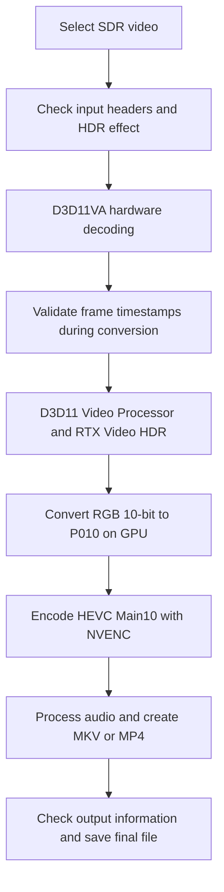

# RTX Video HDR Upscaler

English | **[한국어 문서 (Korean)](docs/ko/README.md)**

**The code in this project was written using OpenAI Codex.**

**A Windows application that takes one SDR video, applies HDR upscaling with NVIDIA RTX Video HDR, and saves the result as a video file.**

Choose a video, GPU, output format, and quality in the GUI. The output is **HEVC Main10 · BT.2020 · PQ**, saved as MKV or MP4. All conversion runs locally on your PC.

> Latest release: **v0.4.3 — SDR/HDR split comparison for full videos and previews**
> The original resolution and frame rate are preserved. Spatial resolution upscaling and frame interpolation are not included.

[Technology](#technology) · [NGX HDR comparison](#how-does-this-differ-from-ngx-hdr-truehdr) · [Pipeline](#how-it-works) · [GUI guide](#gui-guide) · [CLI guide](#command-line-usage) · [Troubleshooting](#troubleshooting) · [Build](#building-from-source)

## Features

- Switch between English and Korean in the GUI; your choice is saved
- Convert one video through a file picker or drag and drop
- Select an NVIDIA GPU for decoding, HDR processing, and encoding
- Save MKV or MP4 with bitrate or CQ quality settings
- Hardware decoding and GPU color conversion
- Progress, processing speed, and estimated remaining time
- Preview conversion, cancellation, and buttons to play the result or open its folder
- **Resume conversion** after failure or cancellation, reusing saved video segments and muxed output
- Preserve the source, prevent overwriting existing output, and save error logs

## Technology

| Component | Role |
|---|---|
| **RTX Video HDR extension in the NVIDIA driver** | Applies HDR processing to SDR frames |
| **Direct3D 11 / Video Processor** | Processes frames on the selected GPU and invokes the NVIDIA HDR extension |
| **D3D11 compute shader** | Converts HDR RGB 10-bit pixels into P010 for encoding |
| **FFmpeg + D3D11VA** | Hardware-decodes the input video |
| **FFmpeg + NVIDIA NVENC** | Encodes HEVC Main10, processes audio, and creates MKV/MP4 files |
| **ffprobe** | Reads input information and checks output codecs and color metadata |
| **C++20 / C# Windows Forms** | C++ conversion engine and .NET Framework 4.8 GUI |

HDR processing uses the driver's D3D11 extension path. The application does not call the RTX Video SDK TrueHDR API directly. NVEncC's processing stages and buffer management informed the design; NVEncC is neither installed nor invoked at runtime.

## How does this differ from NGX HDR (TrueHDR)?

Here, **NGX HDR** means **calling RTX Video SDK TrueHDR from an application**, as NVEncC does with `--vpp-ngx-truehdr`. NVEncC documents this option as SDK-based SDR-to-HDR conversion. [NVEncC options](https://github.com/rigaya/NVEnc/blob/master/NVEncC_Options.en.md#--vpp-ngx-truehdr-param1value1param2value2)

Both approaches extend SDR video to HDR. **The confirmed differences are the invocation path, exposed controls, and frame-processing architecture.** This project has not established whether they use different AI models or which produces better image quality.

| Comparison | This application: driver RTX Video HDR path | NGX TrueHDR: NVEncC SDK path |
|---|---|---|
| HDR invocation | Sends an NVIDIA HDR extension to the D3D11 Video Processor | Initializes RTX Video SDK/NGX and invokes frame processing |
| HDR effect controls | **NVIDIA App provides peak brightness, middle grey, contrast, and saturation controls for RTX Video HDR.** This application has no separate effect-control UI. See the verification limits below | Exposes `contrast`, `saturation`, `middlegray`, and `maxluminance` |
| Encoding quality | CQ and bitrate control HEVC compression quality after HDR processing | TrueHDR effect parameters and encoder quality settings are configured separately |
| Application structure | Standalone GUI, C++ engine, FFmpeg shared libraries, and external tools; no direct TrueHDR SDK call | Invokes the SDK as an NVEncC video filter within its encoding pipeline |
| File output | This application handles HEVC Main10 encoding and MKV/MP4 output | TrueHDR is a processing filter; the calling application, such as NVEncC, determines the codec and container |

The NGX effect parameters and filter architecture are based on the [NVEncC options](https://github.com/rigaya/NVEnc/blob/master/NVEncC_Options.en.md#--vpp-ngx-truehdr-param1value1param2value2) and [NGX filter source](https://github.com/rigaya/NVEnc/blob/master/NVEncCore/NVEncFilterNGX.cpp). This application's extension calls and pixel processing are in [pipeline.cpp](src/pipeline.cpp). The comparison was checked on 2026-09-06; external implementations may change between versions.

**Usage notes**

- **Changing CQ or Mbps in this GUI does not directly set HDR peak brightness, midtone brightness, or saturation.** These settings control output compression quality.
- **Adjust the HDR effect in NVIDIA App's RTX Video HDR settings.** It provides sliders for peak brightness, middle grey, contrast, and saturation. [NVIDIA announcement](https://www.nvidia.com/en-au/geforce/news/nvidia-app-beta-update-rtx-vsr-hdr-controls-and-more/)
- NVIDIA App's controls and verification of their effect on this application's output are separate matters. The application has been tested with Windows HDR and driver RTX Video HDR working, but the effect of each slider on saved HDR files has not yet been measured separately.
- Not calling the SDK directly does **not** establish that the driver does not use NGX internally. Whether the internal models or algorithms are the same remains unverified.
- The SDK path should not be assumed to use an older model, nor the driver path assumed to offer better quality or speed. A comparison must match input frames, GPU, driver, HDR settings, color conversion, and encoding settings. Existing performance records measure this application itself; they are not benchmarks against NGX HDR.

**HDR expansion and spatial upscaling are separate features.** NVIDIA distinguishes Super Resolution from SDR-to-HDR tone mapping in the RTX Video SDK. In this application, “HDR upscaling” means SDR-to-HDR processing while preserving pixel resolution. [NVIDIA RTX Video SDK overview](https://developer.nvidia.com/rtx-video-sdk/getting-started)

## How it works



1. **Check the input and environment.** Read the codec, resolution, color metadata, and frame rate. Process a separate test pattern with HDR off and on; stop if the difference is insufficient.
2. **Decode the frames needed for conversion.** D3D11VA hardware decoding is the default. The application does not decode the entire input again before starting.
3. **Validate decoded frame timing.** Check frame indices, timestamps, dimensions, color metadata, and related information in sequence. Stop on unsupported inputs, including variable or discontinuous timelines.
4. **Apply HDR processing and color conversion on the GPU.** Interpret the driver's HDR RGB output as BT.2020/PQ and use a GPU shader to produce limited-range P010, a pixel format for 10-bit YUV 4:2:0 data.
5. **Finish encoding and saving.** Encode with NVENC, combine the audio, and check the codec, color tags, and dimensions before publishing the final file.

The default path uses FFmpeg shared libraries and the same D3D11 device. It connects decoded textures → HDR → P010 textures → NVENC without reading video frames back to the CPU. Eight NVENC surfaces and a four-frame delay allow work to overlap. External FFmpeg/ffprobe handle audio muxing and output checks. `--pipe-video` selects the earlier pipe path. A full decode of the output is omitted by default and can be enabled for development validation.

## Requirements

- **Windows x64** and **.NET Framework 4.8**
- An **NVIDIA RTX GPU and driver environment** that pass this application's HDR effect check
- Working **Windows HDR and NVIDIA RTX Video HDR settings**
- **ffmpeg.exe** and **ffprobe.exe** with D3D11VA and `hevc_nvenc` support
- An **HDR display and HDR-capable player** to view the result correctly

Use the first-run **Install required components** button or `Setup-Runtime.cmd` to install FFmpeg shared DLLs and ffmpeg/ffprobe beside the application. An internet connection is required. The installer verifies a ZIP from a date-pinned URL with SHA256. Installation stays inside the application folder; administrator privileges and PATH changes are unnecessary. The CLI also accepts `--ffmpeg-dir`. The application does not change Windows HDR or NVIDIA App settings.

Tested configurations include RTX 5080 / RTX 4060, NVIDIA driver 616.56, FFmpeg shared libraries 8.1.2, and external tools 8.0/8.1.2. Extension behavior can depend on the GPU, driver, and display settings; compatibility with every combination is not guaranteed.

## GUI guide

Use the **Language / 언어** dropdown at the top right to select **English** or **한국어**. Labels, progress stages, application error messages, and file-picker titles update immediately, including during conversion. Switching language preserves the current job, source/output paths, and quality settings.

The selection is saved as `language=en` or `language=ko` in the `[interface]` section of `settings.ini`. With no valid saved choice, the GUI starts in Korean on Korean Windows and English otherwise. Existing settings files remain compatible. Earlier log entries are retained as recorded; raw engine/FFmpeg diagnostics remain in their original language, and Windows-owned dialog controls follow Windows settings.

### 1. Launch the application

Download and extract the Windows x64 ZIP from [GitHub Releases](https://github.com/yoonun-ynun/RTX-Video-HDR-Upscaler/releases/latest), then run **`RTXVideoHDR.exe`**. If you downloaded only the source, follow [Building from source](#building-from-source).

The ZIP includes the GUI, conversion engine, default settings, documentation, and runtime installer. It does not redistribute FFmpeg binaries; the installer downloads them directly from BtbN's official GitHub distribution. Existing FFmpeg tools in the application folder or PATH are checked and reused first. If a typical standalone executable installation lacks the GPU-processing DLLs, the GUI asks only for the missing DLLs. The GUI reopens after installation. For environments with restricted downloads, obtain the date-pinned ZIP separately and run `tools/setup-runtime.ps1 -Archive PATH -Destination APPLICATION_FOLDER`. Test videos and personal settings are not included.

Keep these files together:

```text
RTXVideoHDR.exe                 GUI
RTXVideoHDR.exe.config          GUI runtime configuration
settings.ini                   Output quality settings, saved automatically
RTXVideoHDRConvert.exe          Conversion engine
Setup-Runtime.cmd              First-run runtime installer
tools/                         Installer scripts and verification hashes
native-runtime.required        Marker used by the GUI's runtime check
avcodec-62.dll, etc.            Shared libraries downloaded by the installer
ffmpeg.exe / ffprobe.exe        Muxing and inspection tools downloaded by the installer
```

### 2. Choose the video and output settings

1. Select a file with **Source video → Browse**, or drop one file onto the window.
2. Check **Output location**. The default is `source-name.hdr.mkv` beside the source. Changing the input resets even a manually chosen output path to the new source's HDR filename, while preserving the selected MKV/MP4 format.
3. Select an NVIDIA GPU under **GPU to use**. GPU indices distinguish adapters with the same model name.
4. Choose the **Output format** and **Encoding mode**.
5. Click **Start HDR upscaling**.

After completion, use **Play result** or **Output folder**. Clicking **Cancel** or closing the window during conversion stops the current job. The source is not modified. Failed or canceled jobs retain temporary videos for resuming; successful jobs automatically remove large intermediates.

### Status after video processing finishes

After the last frame, encoder output, audio processing, and container work may remain. The GUI distinguishes these stages:

1. **Video frames processed · Finalizing encoder** — frame progress shows 100%.
2. **Video complete · Muxing audio** — MKV copies audio; MP4 converts to AAC and builds the file. Without audio, only the video container is created.
3. **Video and audio processed · Checking output** — checks codecs and HDR color metadata.
4. **Finalizing output file** — saves the file at its final path.
5. **Output saved · Cleaning intermediate files** — the v0.4.2 build removes large temporary files and keeps logs.
6. **HDR conversion complete** — displayed after the engine exits successfully and the final file exists.

From audio muxing through final saving, the GUI hides FPS and video-based time estimates and shows an activity indicator. The engine flushes stage notifications immediately so buffered output does not leave stale FPS information on screen.

### Processing speed (FPS)

- **Recent 5-second FPS**: frames processed in the last five seconds divided by five. During the first five seconds, the actual elapsed interval is used.
- **Cumulative average FPS**: all frames processed since the frame loop started, divided by elapsed time.
- **Remaining time**: estimated remaining frames divided by recent processing speed. Final audio processing and file finalization are excluded.

Both values measure conversion throughput, not the source playback frame rate. A monotonic clock counts frames delivered to the encoder after decoding, timestamp validation, HDR processing, and color conversion. The values are neither GPU-only speed nor the number of frames finalized in the output file. Decode, GPU, and pipe waits count toward elapsed time. Initial header/HDR checks and final encoder shutdown, audio processing, and file finalization are outside the live FPS calculation.

Earlier versions displayed only the cumulative average. For example, after starting at 100 fps and settling at 50 fps, the recent rate stays at 50 fps while the average continues to decline for a while. A falling average alone does not establish that current throughput is falling. If throughput and waiting time are constant from the start, the average should not keep declining.

The display updates roughly every 0.5 seconds when a processed frame becomes available. If one frame stalls for a long time, the previous measurement remains visible until the next frame completes.

### MKV versus MP4

MKV and MP4 are **containers**. Both use HEVC Main10 with the same HDR color format.

| Setting | MKV | MP4 |
|---|---|---|
| Video | HEVC Main10 / BT.2020 / PQ | HEVC Main10 / BT.2020 / PQ |
| Audio | Original stream copy | Re-encoded to AAC with a 320 kbps target |
| Characteristics | Preserves audio without recompression | Uses the hvc1 tag and faststart |

### Quality settings

| Mode | GUI setting | Meaning |
|---|---|---|
| **Quality-based (CQ)** | Default **18**, range 0–51 | Lower values target higher quality and larger files. Bitrate varies by scene. |
| **Average bitrate (VBR)** | Value in Mbps | Targets the specified average bitrate; for example, 40 means 40 Mbps. |

A bitrate that is too low can reduce image quality through compression. Higher values do not recover detail absent from the source. VBR is neither a constant bitrate nor a minimum quality guarantee; 40 Mbps is an example. Choose either CQ or VBR.

### Automatic settings persistence

Output quality settings are saved immediately to **`settings.ini`** beside the executable and restored on the next launch:

- Interface language (English/Korean)
- Encoding mode (CQ/VBR), CQ value, and average bitrate
- Output format (MKV/MP4), selected GPU index and name
- The checkpoint preference described under [Resuming failed or canceled jobs](#resuming-failed-or-canceled-jobs)

Preview conversion, SDR/HDR comparison and the assumed-color option are input-specific and reset on each launch. Source and output paths are not stored in the settings file. If the saved GPU is unavailable, the first available GPU is selected. Invalid values fall back to defaults. A settings write failure is shown in the GUI log.

To reset settings, close the application and delete `settings.ini`. Copy your existing `settings.ini` when moving to a new version's folder to retain your preferences.

### Additional options

- **Preview conversion: first 432 frames** — inspect a short result first. Duration depends on the source rate: about 6 seconds at 71.928 fps or 14.4 seconds at 30 fps.
- **Compare SDR / HDR: left SDR · right HDR** — output the left half of each frame as an SDR reference and the right half with RTX HDR. Enable this alone for the full video; also enable **Preview: first 432 frames** for a short sample. Default name: `source.compare.hdr.mkv` or `.mp4`. Checkpoints support resuming comparison jobs after failure or cancellation.
- **Assume BT.709 for untagged SDR** — use only for known SDR video with missing color tags. It does not force conversion of known other color spaces or HDR input.

The entire comparison file uses BT.2020/PQ HDR. The left side receives no HDR expansion; its SDR reference white is mapped to 203 nits in the HDR color space. This is not an exact match for the Windows SDR brightness slider or every SDR player. View it with HDR enabled on an HDR display and player. Additional GPU work can reduce conversion speed. Resolution, frame rate and the selected container’s audio handling are preserved. Comparison defaults to off on launch; resuming a job restores its saved comparison mode.

## Recommended post-processing: final re-encode with explicit HDR metadata

**After HDR upscaling, inspect the result and perform a final re-encode with accurate `master-display`, `colormatrix`, `colorprim`, and `transfer` settings.** For a file intended for distribution, check that pixel color representation and HDR metadata agree.

The option names below follow NVEncC. With another encoder, use the equivalent options.

| Option | When post-processing this application's output |
|---|---|
| `colormatrix` | `bt2020nc` — BT.2020 non-constant luminance |
| `colorprim` | `bt2020` — BT.2020 color primaries |
| `transfer` | `smpte2084` — PQ transfer function |
| `master-display` | RGB primary and white-point coordinates, plus maximum/minimum luminance, matching the actual HDR mastering conditions |

The engine already writes and checks the BT.2020/PQ tags corresponding to `colormatrix`, `colorprim`, and `transfer`. However, **it does not automatically determine and write accurate `master-display` information.** Mastering information cannot be inferred from the SDR source or file extension alone; specify it from verified conditions. Do not copy values from another video or an arbitrary 1000-nit example. `colorprim=bt2020` does not necessarily mean the mastering display's physical primary coordinates are BT.2020.

Keep HEVC Main10 and 10-bit output when re-encoding, and do not apply SDR-to-HDR processing again to an already-HDR result. Lossy re-encoding can introduce additional compression loss, so use sufficient quality and check both metadata and playback afterward. See [NVEncC HDR metadata options](https://github.com/rigaya/NVEnc/blob/master/NVEncC_Options.en.md#--master-display-string-or-copy-hevc-av1) for syntax.

## Supported input and current scope

| Item | Supported range |
|---|---|
| Input codec | H.264 / HEVC |
| Input color | SDR BT.709, limited/TV range |
| Input pixel format | 8/10-bit YUV 4:2:0 |
| Frame structure | Progressive, constant frame rate, square pixels |
| Frame rate | 1–120 fps |
| Resolution | Even width and height, up to 8192×8192; actual support depends on the GPU |
| Output | HEVC Main10 HDR, MKV / MP4 |

Variable frame rate, discontinuous timestamps, interlaced video, and inputs with rotation metadata are unsupported in the current version. Subtitles, chapters, and attachments are not copied. The application processes one video at a time and has no batch mode.

Visual/numerical equivalence to browser RTX Video HDR and completion of the entire 23-minute source video have not yet been verified. The HDR ON/OFF check detects whether the effect is working; it does not establish browser equivalence.

## Command-line usage

Run these examples in PowerShell from the executable folder. Replace `input.mp4` with your actual input path.

```powershell
# List available NVIDIA GPUs and indices
.\RTXVideoHDRConvert.exe --list-gpus

# Default CQ 18 quality, MKV output
.\RTXVideoHDRConvert.exe "input.mp4" --output "output.hdr.mkv"

# GPU 1, average 40 Mbps, MP4 output
.\RTXVideoHDRConvert.exe "input.mp4" --adapter 1 --bitrate 40M --output "output.hdr.mp4"

# Full-video split comparison (add --max-frames 432 for a short preview)
.\RTXVideoHDRConvert.exe "input.mp4" --compare-sdr-hdr --output "input.compare.hdr.mkv"

# Explicit CQ, preview only the first 432 frames
.\RTXVideoHDRConvert.exe "input.mp4" --cq 18 --max-frames 432 --output "preview.hdr.mkv"

# Explicit FFmpeg tool directory
.\RTXVideoHDRConvert.exe "input.mp4" --ffmpeg-dir "C:\ffmpeg\bin" --output "output.hdr.mkv"
```

`--bitrate 40M` and `--bitrate 40000k` specify the same value. `--bitrate` and `--cq` cannot be used together.

| Diagnostic option | Purpose |
|---|---|
| `--assume-bt709` | Treat untagged SDR as BT.709 |
| `--software-decode` | Explicitly select software instead of hardware decoding |
| `--cpu-color` | Use the CPU reference calculation instead of GPU color conversion for comparison |
| `--diagnostics` | Save raw HDR effect comparisons and selected raw frame samples |
| `--verify-full` | Decode the entire output to check frame count; adds processing time |

## Troubleshooting

Check the GUI log and the **`rtxhdr-run-*`** directory beside the output.

| File | Information |
|---|---|
| `error.json` | Failure reported by the engine |
| `decode.log` | Input decoding and frame timing |
| `encode.log` | NVENC encoding errors |
| `mux.log` | Audio processing and container errors |
| `environment.json` | Selected GPU and HDR extension state |
| `result.json` | Successful conversion settings, frame count, and processing time |

- **Output already exists**: choose another output filename.
- **HDR effect not detected**: check Windows HDR, NVIDIA RTX Video HDR settings, and the selected GPU.
- **FFmpeg tools not found**: place both executables beside the engine or on PATH.
- **Timestamp discontinuity**: the input is outside the currently supported range. Check the reported frame and `decode.log`.

Cancellation immediately terminates the process, so `error.json` may be absent. Temporary videos can occupy disk space in the job folder. Once a job has stopped, unneeded folders can be removed manually.

## Building from source

Required development tools:

- Visual Studio 2022 C++ desktop development tools and Windows SDK
- CMake 3.24 or later, or the CMake bundled with Visual Studio
- PowerShell 7
- .NET Framework 4.8; the GUI build uses the Windows C# compiler

Run from the repository root:

```powershell
# Direct GPU path: download and extract the package pinned in tools/ffmpeg-native-lock.json
.\tools\build.ps1 -FFmpegRoot "C:\dev\ffmpeg-shared"

# Build only the earlier pipe path, without shared libraries
.\tools\build.ps1

# Rebuild only the GUI
.\tools\build-gui.ps1

# Launch the built GUI
.\build\Release\RTXVideoHDR.exe
```

### Code structure

| Path | Role |
|---|---|
| [src/gui.cs](src/gui.cs) | GUI, GPU/quality settings, progress, and cancellation |
| [src/convert_main.cpp](src/convert_main.cpp) | Conversion flow from input checks through encoding, audio processing, and final validation |
| [src/pipeline.cpp](src/pipeline.cpp) | D3D11 resources, NVIDIA HDR extension, and GPU P010 conversion |
| [src/frame_timing.h](src/frame_timing.h) | Frame metadata and timestamp validation during actual decoding |
| [src/child_process.cpp](src/child_process.cpp) | FFmpeg/ffprobe execution, pipes, and child-process cleanup |
| [src/color.h](src/color.h) | CPU reference calculations for comparison with GPU color conversion |
| [tests](tests) · [tools](tools) | Build, packaging, and GUI/color/path/output validation |

## Resuming failed or canceled jobs

The GUI's **Save segments for new conversions (resume support)** option controls checkpoints. It is enabled by default, and `checkpoint=true/false` in `settings.ini` preserves the selection across launches.

- **On**: save a resume point roughly every 10 seconds of video, with additional processing overhead.
- **Off**: prioritize speed without segment saves. The new job cannot resume after failure or cancellation.

This option applies to new jobs. Even with it disabled, **Resume conversion** can reopen an existing checkpoint job, and the most recent checkpoint location is retained.

With checkpoints enabled, the default direct GPU path saves an independently playable HEVC segment **roughly every 10 seconds of source video**. `checkpoint.txt` is updated atomically only after encoder finalization, file synchronization, and SHA256 calculation succeed for that segment. An interruption before the first save requires starting over; later interruptions reprocess only the unfinished segment after the last save. The interval refers to **source playback time**, not wall-clock waiting time.

1. After failure or cancellation, or after reopening the application, click **Resume conversion**.
2. Select **checkpoint.txt** in the `rtxhdr-run-*` folder beside the original output location. The most recent job location opens by default.
3. The source/output paths, GPU, CQ/bitrate, and frame limit are restored and checked before resuming. Other settings currently entered in the GUI are not mixed into the job.

| Interruption point | Resume behavior |
|---|---|
| During video processing | Seek to a keyframe before the next unsaved position, hardware-decode only the required preroll, then continue conversion |
| During audio muxing after all video segments were saved | Skip video conversion and rerun audio muxing |
| During validation/final saving after muxed output was saved | Reuse the muxed file and retry validation and publication |
| Immediately after moving the final file | Recognize completion if the final output matches the recorded SHA256 |

Resume reads saved segments to verify their hashes, but **does not decode the entire source from the beginning**. The source is checked by path, size, modification time, and sample hashes from its beginning, middle, and end. This is not a full byte hash of the source. Missing/corrupt segments or a changed source cause resume to be refused. The converter and FFmpeg shared libraries are also hash-checked, so **do not replace the build or DLLs until the job is complete**. GPU and driver identity are checked when video processing remains.

**Keep NVIDIA App HDR effect settings unchanged during a job and between resume attempts.** The application cannot read or restore every external effect setting. HDR processing is initialized again after a process restart; visual identity at restart boundaries is not guaranteed for all content.

Saved segments are concatenated without re-encoding. Original audio is copied or converted to AAC only once at the end, avoiding cumulative delays that could result from re-encoding MP4 audio per segment. Recent/average FPS count frames newly processed in this attempt; overall progress also includes restored segments.

- **Keep the entire rtxhdr-run folder together**, including the checkpoint and segments. Moving only `checkpoint.txt` is insufficient for resume.
- In the current build, successful audio muxing, output validation, and final saving trigger automatic removal of intermediate videos and large raw frame files. Logs and small job metadata remain. During processing, extra disk space is needed for the segment total and final output.
- Temporary files from older versions without checkpoints cannot resume through this mechanism.
- Segment resume is unavailable on the `--pipe-video`, `--serial-pipeline`, `--software-decode`, `--cpu-color`, and `--diagnostics` comparison paths.

```powershell
# Manual resume: restore original settings from the checkpoint
.\RTXVideoHDRConvert.exe --resume "D:\Video\rtxhdr-run-123-456\checkpoint.txt"

# Change the interval: 1–600 seconds of source video, default 10
.\RTXVideoHDRConvert.exe "input.mp4" --checkpoint-seconds 30

# Prioritize speed, as with checkpoints disabled in the GUI (cannot resume)
.\RTXVideoHDRConvert.exe "input.mp4" --no-checkpoint
```

### Improved error records

Each retry creates a diagnostic subfolder inside the job folder and preserves previous records. The engine's `error.json` records the build version, backend, failure stage, last submitted frame count, saved frame count, elapsed time, free disk space, GPU/driver identity, and D3D device-removal HRESULT. GPU memory usage and budget are included when available. Each segment's FFmpeg API log is saved as `native.log` in its segment folder.

If the GUI cancels a job or the engine exits abnormally, a separate `gui-exit-*.json` records the exit code, cancellation state, stage, last progress display, arguments, and GUI log. This can survive an engine failure before `error.json` is written. If the GUI is also forcibly terminated, or storage/permissions prevent writing, the exit record may be absent; an already saved checkpoint can still be selected for resume. Diagnostic files contain local paths.

See the [validation record](docs/checkpoint-validation.md) for resume/failure-injection tests and checkpoint overhead. Segment saves require extra encoder initialization and disk writes and can reduce speed.

### Automatic intermediate cleanup after success (v0.4.2)

After conversion, the GUI enters **Output saved · Cleaning intermediate files**. Resume files are not deleted before final publication or after failure/cancellation. Successful cleanup also applies to the single-encoder and pipe paths with checkpoints disabled.

- Removed: application-generated `video.mkv`, `completed.mkv/mp4`, segment videos, same-named intermediate videos from failed earlier attempts within this job, `guard-on/off.rgb10a2`, and `frame-N.rgb10a2/p010`.
- Preserved: final output, source, `*.log`, diagnostic/command/performance JSON, `checkpoint.txt`, frame timing, concat lists, and other small metadata. Unknown filenames and other job folders are untouched.
- `cleanup.json` records removed file/byte counts and removal failures. Files in use or lacking delete permission remain, while the conversion itself is still reported as successful.
- Reopening a completed checkpoint job verifies the final file hash and retries only leftover intermediate cleanup. Completion is recognized even when segments have already been deleted. A deleted or modified final file is not accepted as completed.
- Linked folders/files are not followed for deletion. Hard links referring to the source or final output are also protected.

For CLI experiments that need intermediate data, specify `--keep-intermediates`. In particular, combine it with `--diagnostics` when external tools need the raw RGB/P010 samples. The option applies only to that invocation.

```powershell
.\RTXVideoHDRConvert.exe "input.mp4" --diagnostics --keep-intermediates
.\RTXVideoHDRConvert.exe --resume "D:\Video\rtxhdr-run-123-456\checkpoint.txt" --keep-intermediates
```

The application does not scan already-completed folders from older releases or other running jobs. Cleanup applies to jobs that finish successfully using the new build.
