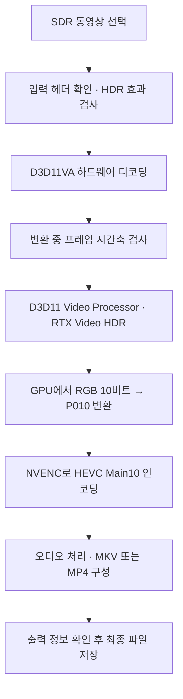

# RTX Video HDR 업스케일러

[English](../../README.md) | **한국어**

**이 프로젝트의 코드는 OpenAI Codex를 사용해 작성되었습니다.**

**SDR 동영상 하나를 입력하면 NVIDIA RTX Video HDR로 HDR 업스케일링해 영상 파일로 저장하는 Windows 프로그램입니다.**

GUI에서 영상, GPU, 출력 형식과 품질을 선택할 수 있습니다. 결과는 **HEVC Main10 · BT.2020 · PQ** 형식의 MKV 또는 MP4로 저장됩니다. 모든 변환은 로컬 PC에서 실행합니다.

> 최신 릴리즈: **v0.4.3 — 전체 영상·시험 변환 SDR/HDR 좌우 비교**
> 원본 해상도와 프레임률을 유지합니다. 해상도 업스케일링이나 프레임 보간 기능은 포함하지 않습니다.

[사용 기술](#무엇을-이용하나요) · [NGX HDR 비교](#ngx-hdrtruehdr과-무엇이-다른가요) · [작동 과정](#어떤-순서로-작동하나요) · [GUI 사용법](#gui-사용법) · [CLI 사용법](#명령줄-사용법) · [문제 해결](#오류가-발생했을-때) · [빌드](#소스에서-빌드하기)

## 주요 기능

- GUI에서 영어·한국어 선택 및 선택한 언어 자동 저장
- 파일 선택 또는 드래그 앤 드롭으로 영상 한 개 변환
- 사용할 NVIDIA GPU 선택 — 디코딩, HDR 처리, 인코딩에 같은 GPU 지정
- MKV / MP4 저장 및 비트레이트 / CQ 품질 설정
- 하드웨어 디코딩과 GPU 색 변환
- 진행 상황, 처리 속도, 추정 남은 시간 표시
- 시험 변환, 취소, 완료 후 결과 재생·저장 폴더 열기
- 실패·취소 후 **이어서 변환**: 완료된 영상 구간과 오디오 결합 결과 재사용
- 원본 보존, 기존 결과 덮어쓰기 방지, 오류 로그 저장

## 무엇을 이용하나요?

| 구성 요소 | 역할 |
|---|---|
| **NVIDIA 드라이버의 RTX Video HDR 확장** | SDR 프레임에 HDR 처리를 적용하는 핵심 기능 |
| **Direct3D 11 / Video Processor** | 선택한 GPU에서 영상 프레임을 처리하고 NVIDIA HDR 확장을 호출 |
| **D3D11 compute shader** | HDR 처리된 RGB 10비트 픽셀을 인코딩용 P010 형식으로 변환 |
| **FFmpeg + D3D11VA** | 입력 동영상을 하드웨어 디코딩 |
| **FFmpeg + NVIDIA NVENC** | HEVC Main10 하드웨어 인코딩, 오디오 처리, MKV/MP4 파일 구성 |
| **ffprobe** | 입력 정보와 결과 파일의 코덱·색 정보 확인 |
| **C++20 / C# Windows Forms** | C++ 변환 엔진과 .NET Framework 4.8 기반 GUI |

HDR 처리는 드라이버의 D3D11 확장 경로를 사용합니다. RTX Video SDK의 TrueHDR API를 직접 호출하는 구성은 아닙니다. NVEncC의 처리 단계·버퍼 관리 구조를 참고했으며, 실행할 때 NVEncC를 설치하거나 호출하지 않습니다.

## NGX HDR(TrueHDR)과 무엇이 다른가요?

여기서 **NGX HDR**은 NVEncC의 `--vpp-ngx-truehdr`처럼 **RTX Video SDK의 TrueHDR 기능을 애플리케이션에서 호출하는 방식**을 뜻합니다. NVEncC 문서는 이 옵션을 RTX Video SDK 기반 SDR→HDR 변환으로 설명합니다. [NVEncC 옵션 문서](https://github.com/rigaya/NVEnc/blob/master/NVEncC_Options.en.md#--vpp-ngx-truehdr-param1value1param2value2)

둘 다 SDR 영상을 HDR로 확장하는 목적을 갖습니다. **현재 확인할 수 있는 차이는 기능을 호출하는 경로, 조절 가능한 설정, 프레임을 처리하는 구성입니다.** 서로 다른 AI 모델인지, 어느 쪽 화질이 더 좋은지는 이 프로젝트에서 입증하지 않았습니다.

| 비교 항목 | 이 프로그램: 드라이버 RTX Video HDR 경로 | NGX TrueHDR: NVEncC의 SDK 경로 |
|---|---|---|
| HDR 기능 호출 | D3D11 Video Processor에 NVIDIA 전용 HDR 확장 전달 | RTX Video SDK/NGX 기능을 초기화하고 프레임 처리 호출 |
| HDR 효과 조절 | **NVIDIA App에서 RTX Video HDR의 최대 밝기·중간 회색 밝기·대비·채도 조절 가능.** 이 프로그램에는 별도 효과 조절 UI가 없음. 출력 반영 검증 범위는 아래 참고 | `contrast`, `saturation`, `middlegray`, `maxluminance` 제공 |
| 인코딩 품질 설정 | CQ·비트레이트는 HDR 처리 후 HEVC 압축 품질을 조절 | TrueHDR 효과 파라미터와 인코더 품질 설정을 구분해서 사용 |
| 애플리케이션 구성 | 독립 GUI + C++ 엔진 + FFmpeg 공유 라이브러리 및 외부 도구. 앱에서 TrueHDR SDK를 직접 호출하지 않음 | NVEncC의 영상 필터로 SDK 기능을 호출해 인코딩 흐름에 연결 |
| 파일 저장 | HEVC Main10, MKV/MP4 저장까지 이 프로그램이 처리 | TrueHDR은 처리 필터이며 최종 코덱·컨테이너는 NVEncC 등 호출 프로그램에서 결정 |

NGX 쪽 효과 파라미터와 필터 구성은 [NVEncC 옵션 문서](https://github.com/rigaya/NVEnc/blob/master/NVEncC_Options.en.md#--vpp-ngx-truehdr-param1value1param2value2) 및 [NGX 필터 소스](https://github.com/rigaya/NVEnc/blob/master/NVEncCore/NVEncFilterNGX.cpp)를 기준으로 정리했습니다. 이 프로그램의 드라이버 확장 호출과 픽셀 처리는 [pipeline.cpp](../../src/pipeline.cpp)에서 확인할 수 있습니다. 비교 확인일은 2026-09-06이며, 외부 프로젝트의 구현은 버전에 따라 달라질 수 있습니다.

**사용할 때 알아둘 점**

- 이 GUI의 **CQ나 Mbps를 바꿔도 HDR의 최대 밝기·중간 밝기·채도를 직접 지정하는 것은 아닙니다.** 출력 압축 품질을 바꾸는 설정입니다.
- **HDR 효과는 NVIDIA App의 RTX Video HDR 설정에서 조절할 수 있습니다.** 최대 밝기(peak brightness), 중간 회색 밝기(middle grey), 대비(contrast), 채도(saturation) 슬라이더를 제공합니다. [NVIDIA 공식 안내](https://www.nvidia.com/en-au/geforce/news/nvidia-app-beta-update-rtx-vsr-hdr-controls-and-more/)
- NVIDIA App의 조절 기능과 이 프로그램의 출력 반영 검증은 구분합니다. 현재 프로그램은 Windows HDR와 드라이버 RTX Video HDR이 작동하는 환경에서 검증했으며, 각 슬라이더 변경이 저장된 HDR 파일에 어떻게 반영되는지는 아직 별도로 측정하지 않았습니다.
- SDK를 직접 호출하지 않는다는 사실만으로 **드라이버 내부에서도 NGX를 사용하지 않는다**고 판단할 수는 없습니다. 내부 모델·알고리즘의 동일성 또는 차이는 확인되지 않았습니다.
- SDK라는 이유로 오래된 모델이라고 보거나, 드라이버 경로라는 이유로 화질·속도가 더 좋다고 단정하지 않습니다. 비교하려면 같은 입력 프레임, GPU·드라이버, HDR 설정, 색 변환 및 인코딩 조건을 맞춰야 합니다. 기존 성능 기록은 이 프로그램 자체의 측정이며 NGX HDR과의 비교 벤치마크가 아닙니다.

또한 **HDR 확장과 해상도 확대는 별개 기능**입니다. NVIDIA는 RTX Video SDK의 Super Resolution과 SDR→HDR 톤 매핑을 구분해 설명합니다. 이 프로그램의 “HDR 업스케일링”은 SDR→HDR 처리를 뜻하며 픽셀 해상도는 유지합니다. [NVIDIA RTX Video SDK 안내](https://developer.nvidia.com/rtx-video-sdk/getting-started)

## 어떤 순서로 작동하나요?



1. **입력과 실행 환경을 확인합니다.** 코덱, 해상도, 색 정보와 프레임률을 읽습니다. 별도의 시험 패턴에 HDR을 끄고 켜서 결과 차이가 있는지도 확인합니다. 차이가 충분하지 않으면 변환을 중단합니다.
2. **실제 변환에 필요한 프레임을 디코딩합니다.** 기본값은 D3D11VA 하드웨어 디코딩입니다. 시작 전에 영상 전체를 다시 디코딩하는 검사는 하지 않습니다.
3. **디코딩한 프레임의 시간축을 검사합니다.** 프레임 번호, 타임스탬프, 크기, 색 정보 등을 순서대로 확인합니다. 가변·불연속 시간축 등 지원하지 않는 입력을 발견하면 중단합니다.
4. **GPU에서 HDR 처리와 색 변환을 수행합니다.** 드라이버 HDR 출력의 RGB 픽셀을 BT.2020/PQ로 해석하고, GPU 셰이더로 limited-range P010에 담습니다. P010은 10비트 YUV 4:2:0 데이터를 담는 픽셀 형식입니다.
5. **인코딩과 저장을 마무리합니다.** NVENC로 영상을 인코딩하고 오디오를 결합합니다. 코덱·색 태그·크기를 확인한 뒤 최종 결과 파일을 만듭니다.

기본 경로는 FFmpeg 공유 라이브러리와 같은 D3D11 장치를 사용합니다. 디코딩 텍스처 → HDR → P010 텍스처 → NVENC로 연결하며, 영상 프레임을 CPU로 읽어오지 않습니다. 8개 NVENC surface와 4프레임 지연으로 처리를 겹칩니다. 오디오 결합과 출력 확인에는 외부 FFmpeg/ffprobe를 사용합니다. `--pipe-video`는 이전의 파이프 처리 경로를 선택합니다. 전체 출력 재디코딩 검사는 기본 실행에서 생략하며 개발용 옵션으로 선택할 수 있습니다.

## 실행에 필요한 환경

- **Windows x64**, **.NET Framework 4.8**
- 이 프로그램의 HDR 효과 검사를 통과하는 **NVIDIA RTX GPU와 드라이버 환경**
- **Windows HDR 및 NVIDIA RTX Video HDR이 작동하는 설정**
- D3D11VA와 `hevc_nvenc`를 지원하는 **ffmpeg.exe**, **ffprobe.exe**
- 결과를 올바르게 감상할 수 있는 **HDR 디스플레이와 HDR 지원 플레이어**

첫 실행의 **필수 구성 설치** 버튼 또는 `Setup-Runtime.cmd`를 실행하면 FFmpeg 공유 DLL과 ffmpeg/ffprobe가 프로그램 옆에 설치됩니다. 인터넷 연결이 필요하며 날짜 고정 URL의 ZIP을 SHA256 검증한 뒤 사용합니다. 설치는 프로그램 폴더 안에서만 이루어지고 관리자 권한이나 PATH 변경은 필요하지 않습니다. CLI에서는 `--ffmpeg-dir`로 도구 폴더를 지정할 수도 있습니다. 프로그램은 Windows HDR나 NVIDIA App 설정을 변경하지 않습니다.

검증 환경은 RTX 5080 / RTX 4060, NVIDIA 드라이버 616.56, FFmpeg 공유 라이브러리 8.1.2 및 외부 도구 8.0/8.1.2입니다. 드라이버 확장 동작은 GPU·드라이버·디스플레이 설정에 영향을 받을 수 있으며, 모든 조합의 호환성을 보장하지 않습니다.

## GUI 사용법

오른쪽 위 **Language / 언어** 드롭다운에서 **English** 또는 **한국어**를 선택하세요. 제목·버튼·진행 단계·프로그램 오류 안내·파일 선택창 제목이 즉시 바뀌며, 변환 중에도 사용할 수 있습니다. 언어를 바꿔도 실행 중인 작업, 원본·저장 경로와 품질 설정은 유지됩니다.

선택은 `settings.ini`의 `[interface]`에 `language=en` 또는 `language=ko`로 저장됩니다. 유효한 저장값이 없으면 한국어 Windows에서는 한국어, 그 밖의 환경에서는 영어로 시작합니다. 기존 설정 파일도 그대로 사용할 수 있습니다. 이미 기록된 로그는 유지하며, 엔진·FFmpeg 원문 진단과 Windows 자체 대화상자 버튼은 각각 원래 언어와 Windows 설정을 따릅니다.

### 1. 프로그램 실행

[GitHub Releases](https://github.com/yoonun-ynun/RTX-Video-HDR-Upscaler/releases/latest)에서 Windows x64 ZIP을 내려받아 압축을 풀고 **`RTXVideoHDR.exe`**를 실행합니다. 소스만 받은 경우에는 아래 [빌드 방법](#소스에서-빌드하기)을 따르세요.

배포 ZIP에는 GUI, 변환 엔진, 기본 설정, 문서와 구성 설치 도구가 포함됩니다. FFmpeg 바이너리를 재배포하지 않으며, 설치 도구가 BtbN의 공식 GitHub 배포에서 직접 내려받습니다. 프로그램 폴더와 PATH에 있는 FFmpeg 도구를 먼저 확인해 그대로 사용합니다. 일반 단일 실행 파일 배포에 GPU 처리용 DLL이 없으면 DLL 추가만 안내합니다. 설치 후 GUI가 다시 열립니다. 원격 파일을 받기 어려운 환경에서는 날짜 고정 ZIP을 따로 받아 `tools/setup-runtime.ps1 -Archive 경로 -Destination 프로그램폴더`로 설치할 수 있습니다. 시험 영상과 개인 설정은 포함하지 않습니다.

다음 파일은 같은 폴더에 보관합니다.

```text
RTXVideoHDR.exe                 GUI
RTXVideoHDR.exe.config          GUI 실행 설정
settings.ini                   출력 품질 설정 — 자동 저장
RTXVideoHDRConvert.exe          실제 변환 엔진
Setup-Runtime.cmd              첫 실행 구성 설치
tools/                         설치 스크립트와 검증 해시
native-runtime.required        GUI의 구성 확인 표시 파일
avcodec-62.dll 등               설치 도구가 받는 공유 라이브러리
ffmpeg.exe / ffprobe.exe        설치 도구가 받는 오디오 결합·검사 도구
```

### 2. 영상과 출력 설정 선택

1. **원본 영상 → 찾아보기**로 파일을 선택합니다. 창에 파일 하나를 끌어놓아도 됩니다.
2. **저장 위치**를 확인합니다. 기본값은 원본 옆의 `원본이름.hdr.mkv`입니다. 영상을 바꾸면 수동 지정했던 경로도 새 원본 옆의 HDR 파일명으로 갱신되며, 선택한 MKV/MP4 형식은 유지됩니다.
3. **사용할 GPU**에서 NVIDIA GPU를 선택합니다. 같은 모델이 여러 개라면 GPU 번호로 구분합니다.
4. **저장 형식**과 **인코딩 방식**을 선택합니다.
5. **HDR 업스케일링 시작**을 누릅니다.

완료 후 **결과 재생**이나 **저장 폴더** 버튼을 사용할 수 있습니다. 작업 중 **취소**를 누르거나 창을 닫으면 현재 변환을 중단합니다. 원본은 변경하지 않습니다. 실패·취소한 작업은 재개를 위해 임시 영상을 보존하고, 정상 완료한 작업은 큰 중간 파일을 자동 정리합니다.

### 영상 완료 이후의 상태 표시

마지막 프레임을 처리한 뒤에도 인코더 출력, 오디오, 컨테이너 작업이 남을 수 있습니다. GUI는 다음 단계를 구분해 표시합니다.

1. **영상 프레임 처리 완료 · 인코더 마무리 중** — 프레임 처리 막대는 100%로 표시합니다.
2. **영상 완료 · 오디오 muxing 중** — MKV는 오디오 복사, MP4는 AAC 변환과 파일 구성을 진행합니다. 오디오가 없으면 영상 컨테이너만 구성합니다.
3. **영상·오디오 처리 완료 · 결과 검사 중** — 코덱과 HDR 색 정보를 검사합니다.
4. **결과 파일 저장 마무리 중** — 최종 경로에 파일을 저장합니다.
5. **결과 저장 완료 · 중간 파일 정리 중** — v0.4.2 빌드에서 큰 임시 파일을 삭제하고 로그를 남깁니다.
6. **HDR 변환 완료** — 엔진이 성공 종료하고 최종 파일이 존재할 때 표시합니다.

오디오 muxing부터 최종 저장까지는 FPS와 영상 기준 남은 시간을 숨기고 작업 중 표시를 사용합니다. 각 단계 알림은 엔진에서 즉시 전달하므로 이전 FPS 화면이 출력 버퍼에 묶여 남는 문제를 방지합니다.

### 처리 속도(FPS) 표시

- **최근 5초 FPS**: 최근 5초 동안 처리한 프레임 수 ÷ 5초. 시작한 지 5초 미만이면 실제 경과 구간으로 계산합니다.
- **누적 평균 FPS**: 프레임 처리 루프 시작부터 처리한 전체 프레임 수 ÷ 경과 시간.
- **남은 시간**: 추정 잔여 프레임 수를 최근 처리 속도로 나눈 값입니다. 마지막 오디오 처리·파일 마무리 시간은 포함하지 않습니다.

두 수치는 입력 영상의 재생 프레임률이 아닌 변환 처리량입니다. 타이머는 단조 증가 시계를 사용하며, 디코딩 결과 읽기·시간축 검사·HDR 처리·색 변환을 거쳐 인코더에 전달한 프레임을 셉니다. GPU 연산만의 속도나 최종 파일에 기록된 프레임 수를 뜻하지 않습니다. 디코딩·GPU·파이프 대기도 경과 시간에 포함됩니다. 초기 헤더 확인/HDR 효과 검사와 마지막 인코더 종료·오디오 처리·파일 마무리는 실시간 FPS 계산 범위 밖입니다.

이전 버전의 FPS는 누적 평균만 표시했습니다. 예를 들어 초반 100fps 이후 50fps로 일정하게 처리하면 최근 속도는 50fps여도 누적 평균은 한동안 계속 내려갑니다. 따라서 누적 평균만으로 현재 속도가 떨어지고 있다고 판단할 수 없습니다. 처음부터 처리량과 대기 시간이 모두 일정하면 누적 평균이 지속적으로 내려가지는 않습니다.

화면은 처리된 프레임이 나올 때 약 0.5초 간격으로 갱신합니다. 한 프레임 처리가 오래 막히면 다음 프레임이 완료될 때까지 마지막 측정값이 표시됩니다.

### MKV와 MP4의 차이

MKV와 MP4는 파일을 담는 **컨테이너**입니다. 둘 다 영상 코덱은 HEVC Main10이며 HDR 색 형식도 같습니다.

| 설정 | MKV | MP4 |
|---|---|---|
| 영상 | HEVC Main10 / BT.2020 / PQ | HEVC Main10 / BT.2020 / PQ |
| 오디오 | 원본 스트림 복사 | AAC 320 kbps 목표로 재인코딩 |
| 특징 | 오디오 재압축 없이 보존 | hvc1 태그와 faststart 적용 |

### 품질 설정

| 방식 | GUI 설정 | 의미 |
|---|---|---|
| **품질 기준 (CQ)** | 기본 **18**, 범위 0~51 | 낮을수록 높은 품질과 큰 파일을 지향합니다. 장면에 따라 비트레이트가 달라집니다. |
| **평균 비트레이트 (VBR)** | Mbps 단위 입력 | 지정한 평균 비트레이트를 목표로 인코딩합니다. 예: 40 = 40 Mbps |

비트레이트가 너무 낮으면 압축으로 화질이 떨어질 수 있습니다. 다만 높은 값이 원본에 없는 디테일을 복원하지는 않습니다. VBR 값은 고정 비트레이트나 최저 화질 보장이 아니며, 40 Mbps는 사용 예시입니다. CQ와 VBR은 하나를 선택합니다.

### 설정 자동 저장

출력 품질 설정은 실행 파일 옆의 **`settings.ini`**에 변경 즉시 저장되며 다음 실행 때 복원됩니다.

- 표시 언어(English/한국어)
- 인코딩 방식(CQ/VBR), CQ 값, 평균 비트레이트
- 저장 형식(MKV/MP4), 선택한 GPU 번호와 이름
- [실패하거나 취소한 작업 이어서 변환하기](#실패하거나-취소한-작업-이어서-변환하기)의 구간 저장 선택

시험 변환, SDR/HDR 비교와 색 정보 간주 옵션은 입력별 설정으로 다음 실행 때 초기화됩니다. 원본 영상·저장 경로는 설정 파일에 저장하지 않습니다. 저장한 GPU를 찾지 못하면 사용 가능한 첫 GPU를 선택하고, 잘못된 설정값은 기본값으로 대체합니다. 설정을 쓸 수 없는 폴더에서는 GUI 로그에 저장 실패를 표시합니다.

설정을 초기화하려면 프로그램을 종료한 뒤 `settings.ini`를 삭제하세요. 새 버전 폴더로 옮길 때 기존 `settings.ini`를 복사하면 설정을 이어서 사용할 수 있습니다.

### 추가 옵션

- **시험 변환: 첫 432프레임** — 짧은 결과를 먼저 확인합니다. 길이는 입력 프레임률에 따라 달라집니다. 71.928fps에서는 약 6초, 30fps에서는 14.4초입니다.
- **SDR/HDR 비교: 왼쪽 SDR · 오른쪽 HDR** — 같은 프레임의 왼쪽 절반은 SDR 기준으로, 오른쪽 절반은 RTX HDR로 출력합니다. 전체 영상을 비교하려면 이것만 켜고, 짧게 보려면 **시험 변환: 첫 432프레임**도 켜세요. 기본 파일명은 `원본.compare.hdr.mkv` 또는 `.mp4`입니다. 구간 저장을 켜면 비교 모드도 실패·취소 후 이어서 변환할 수 있습니다.
- **색 정보가 없는 SDR을 BT.709로 간주** — 색 태그가 빠진 확실한 SDR 영상에만 사용합니다. 확인된 다른 색공간이나 HDR 입력을 강제로 변환하는 옵션은 아닙니다.

비교 파일 전체는 BT.2020/PQ HDR로 저장됩니다. 왼쪽에는 HDR 확장 효과를 적용하지 않고, SDR 기준 흰색을 203 nits로 정해 HDR 색공간에 옮깁니다. Windows의 SDR 밝기 설정이나 일반 SDR 플레이어와 밝기가 정확히 일치하는 모드는 아닙니다. HDR을 켠 디스플레이와 HDR 지원 플레이어에서 확인하세요. 비교용 GPU 처리가 추가되므로 일반 HDR 변환보다 느릴 수 있습니다. 해상도·프레임률과 MKV/MP4별 오디오 처리 방식은 유지됩니다. 비교 체크박스는 프로그램 재실행 시 꺼지며, 작업 재개 시에는 저장된 비교 설정을 복원합니다.

## 작업 후 권장: HDR 메타데이터를 명시한 최종 재인코딩

**HDR 업스케일링 작업 후에는 결과를 확인하고, 정확한 `master-display`, `colormatrix`, `colorprim`, `transfer`를 명시하여 최종 재인코딩하는 것을 권장합니다.** 특히 최종 배포 파일은 픽셀의 색 표현과 HDR 메타데이터가 일치하는지 확인하세요.

아래 이름은 NVEncC 옵션 기준입니다. 다른 인코더를 사용하면 해당 도구의 동등한 옵션을 지정합니다.

| 항목 | 이 프로그램의 결과를 후처리할 때 |
|---|---|
| `colormatrix` | `bt2020nc` — BT.2020 non-constant luminance |
| `colorprim` | `bt2020` — BT.2020 색 원색 |
| `transfer` | `smpte2084` — PQ 전달 함수 |
| `master-display` | 실제 HDR 마스터링 조건에 맞는 RGB 원색·백색점 좌표와 최대·최소 휘도 |

현재 엔진은 `colormatrix`·`colorprim`·`transfer`에 해당하는 BT.2020/PQ 태그를 이미 기록하고 검사합니다. 다만 **정확한 `master-display` 정보는 자동으로 확정해 기록하지 않습니다.** 마스터링 정보는 SDR 원본이나 파일 확장자만으로 알 수 없으므로, 확인된 조건에 맞춰 지정해야 합니다. 다른 영상의 값이나 임의의 1000nit 예시를 그대로 복사하지 마세요. `colorprim=bt2020`이라고 해서 마스터링 디스플레이의 실제 원색 좌표도 반드시 BT.2020인 것은 아닙니다.

재인코딩할 때는 HEVC Main10과 10비트 출력을 유지하고, 이미 HDR인 결과에 SDR→HDR 처리를 다시 적용하지 마세요. 손실 재인코딩은 추가 압축 손실을 만들 수 있으므로 충분한 품질 설정을 사용하고, 완료 후 색 정보와 실제 재생 결과를 다시 확인하세요. 옵션 형식은 [NVEncC의 HDR 메타데이터 문서](https://github.com/rigaya/NVEnc/blob/master/NVEncC_Options.en.md#--master-display-string-or-copy-hevc-av1)를 참고하세요.

## 지원 입력과 현재 범위

| 항목 | 지원 범위 |
|---|---|
| 입력 영상 코덱 | H.264 / HEVC |
| 입력 색 정보 | SDR BT.709, limited/TV range |
| 입력 픽셀 형식 | 8/10비트 YUV 4:2:0 |
| 프레임 구조 | Progressive, 일정한 프레임률, 정사각형 픽셀 |
| 프레임률 | 1~120fps |
| 해상도 | 가로·세로 짝수, 최대 8192×8192 — 실제 처리 가능 여부는 GPU에 따름 |
| 출력 | HEVC Main10 HDR, MKV / MP4 |

가변 프레임률, 불연속 타임스탬프, 인터레이스, 회전 정보가 있는 입력 등은 현재 버전에서 지원하지 않습니다. 자막·챕터·첨부 파일은 복사하지 않습니다. 한 번에 영상 하나를 처리하며 배치 변환 기능은 없습니다.

브라우저 RTX Video HDR과의 외관·수치적 동일성 및 전체 23분 영상의 장시간 완주는 아직 검증하지 않았습니다. HDR ON/OFF 차이 검사는 효과 작동 여부를 확인하기 위한 것으로, 브라우저 결과와의 동일성 검사는 아닙니다.

## 명령줄 사용법

다음 예시는 실행 파일이 있는 폴더에서 PowerShell로 실행합니다. `input.mp4`를 실제 입력 경로로 바꾸세요.

```powershell
# 사용 가능한 NVIDIA GPU와 번호 확인
.\RTXVideoHDRConvert.exe --list-gpus

# 기본 품질 CQ 18, MKV 출력
.\RTXVideoHDRConvert.exe "input.mp4" --output "output.hdr.mkv"

# GPU 1 선택, 평균 40 Mbps, MP4 출력
.\RTXVideoHDRConvert.exe "input.mp4" --adapter 1 --bitrate 40M --output "output.hdr.mp4"

# 전체 영상 좌우 비교 (짧은 시험은 --max-frames 432 추가)
.\RTXVideoHDRConvert.exe "input.mp4" --compare-sdr-hdr --output "input.compare.hdr.mkv"

# CQ를 직접 지정하고 첫 432프레임만 시험
.\RTXVideoHDRConvert.exe "input.mp4" --cq 18 --max-frames 432 --output "preview.hdr.mkv"

# FFmpeg 도구 위치 직접 지정
.\RTXVideoHDRConvert.exe "input.mp4" --ffmpeg-dir "C:\ffmpeg\bin" --output "output.hdr.mkv"
```

CLI의 `--bitrate 40M`과 `--bitrate 40000k`는 같은 값입니다. `--bitrate`와 `--cq`는 함께 지정할 수 없습니다.

| 진단 옵션 | 용도 |
|---|---|
| `--assume-bt709` | 색 태그가 없는 SDR을 BT.709로 간주 |
| `--software-decode` | 하드웨어 대신 소프트웨어 디코딩을 명시적으로 선택 |
| `--cpu-color` | GPU 색 변환 대신 CPU 기준 계산 사용 — 성능 비교용 |
| `--diagnostics` | HDR 효과 비교와 일부 프레임의 raw 표본 저장 |
| `--verify-full` | 출력 전체를 다시 디코딩하여 프레임 수 검사 — 시간이 추가로 필요 |

## 오류가 발생했을 때

GUI 하단의 로그와 출력 폴더의 **`rtxhdr-run-*`** 디렉터리를 확인하세요.

| 파일 | 확인할 내용 |
|---|---|
| `error.json` | 엔진이 보고한 실패 원인 |
| `decode.log` | 입력 디코딩과 프레임 시간축 |
| `encode.log` | NVENC 인코딩 오류 |
| `mux.log` | 오디오 처리와 파일 구성 오류 |
| `environment.json` | 선택한 GPU와 HDR 확장 상태 |
| `result.json` | 성공한 변환의 설정, 프레임 수, 처리 시간 |

- **출력 파일이 이미 있음**: 다른 저장 이름을 선택합니다.
- **HDR 효과가 검출되지 않음**: Windows HDR, NVIDIA RTX Video HDR 설정과 선택한 GPU를 확인합니다.
- **FFmpeg 도구를 찾지 못함**: 두 실행 파일을 엔진 옆이나 PATH에 준비합니다.
- **시간축 불연속 오류**: 현재 지원 범위를 벗어난 입력입니다. 오류에 표시된 프레임과 `decode.log`를 확인합니다.

취소 시에는 프로세스가 즉시 종료되므로 `error.json`이 없을 수 있습니다. 임시 폴더에는 중간 영상이 남아 용량을 사용할 수 있으며, 작업이 종료된 뒤 필요 없는 폴더를 직접 정리할 수 있습니다.

## 소스에서 빌드하기

필요한 개발 도구:

- Visual Studio 2022의 C++ 데스크톱 개발 도구 및 Windows SDK
- CMake 3.24 이상 또는 Visual Studio에 포함된 CMake
- PowerShell 7
- .NET Framework 4.8 환경 — GUI 빌드는 Windows의 C# 컴파일러 사용

프로젝트 루트에서 실행합니다.

```powershell
# GPU 직접 전달 빌드: tools/ffmpeg-native-lock.json의 패키지를 내려받아 압축 해제
.\tools\build.ps1 -FFmpegRoot "C:\dev\ffmpeg-shared"

# 공유 라이브러리 없이 기존 파이프 경로만 빌드
.\tools\build.ps1

# GUI만 다시 빌드
.\tools\build-gui.ps1

# 빌드된 GUI 실행
.\build\Release\RTXVideoHDR.exe
```

### 코드 구조

| 경로 | 역할 |
|---|---|
| [src/gui.cs](../../src/gui.cs) | GUI, GPU·품질 설정, 진행 상황, 취소 |
| [src/convert_main.cpp](../../src/convert_main.cpp) | 입력 확인부터 인코딩·오디오 처리·완료 검증까지의 변환 흐름 |
| [src/pipeline.cpp](../../src/pipeline.cpp) | D3D11 자원, NVIDIA HDR 확장, GPU P010 변환 |
| [src/frame_timing.h](../../src/frame_timing.h) | 실제 디코딩 중 프레임 메타데이터와 시간축 검사 |
| [src/child_process.cpp](../../src/child_process.cpp) | FFmpeg/ffprobe 실행, 파이프, 자식 프로세스 정리 |
| [src/color.h](../../src/color.h) | GPU 색 변환과 비교하는 CPU 기준 계산 |
| [tests](../../tests) · [tools](../../tools) | 빌드, 배포, GUI·색 변환·파일 경로·출력 검증 |

## 실패하거나 취소한 작업 이어서 변환하기

GUI의 **새 변환에서 구간 저장 (재개 지원)** 옵션으로 구간 저장을 선택할 수 있습니다. 기본값은 켜짐이며 선택은 `settings.ini`의 `checkpoint=true/false`에 저장되어 재실행 후에도 유지됩니다.

- **켜짐**: 영상 약 10초마다 재개 지점을 저장합니다. 추가 처리 비용이 발생합니다.
- **꺼짐**: 구간 저장 없이 속도를 우선합니다. 이 작업은 실패·취소 후 재개할 수 없습니다.

이 옵션은 새로 시작하는 작업에 적용됩니다. 옵션을 꺼도 **이어서 변환** 버튼으로 기존 체크포인트 작업을 재개할 수 있으며, 최근 재개 작업 위치도 유지됩니다.

구간 저장을 켠 기본 GPU 직접 전달 경로는 **영상 약 10초 분량마다** 독립적으로 재생 가능한 HEVC 구간을 저장합니다. 저장 중인 구간의 인코딩 마무리·파일 동기화·SHA256 계산이 모두 성공하면 `checkpoint.txt`를 원자적으로 갱신합니다. 첫 구간이 저장되기 전 중단되면 처음부터 시작하고, 이후에는 마지막 저장 지점 뒤의 미완료 구간만 다시 처리합니다. 간격은 실제 대기 시간이 아니라 **원본 영상의 재생 시간**입니다.

1. 실패·취소 후, 또는 프로그램을 다시 실행한 뒤 **이어서 변환**을 누릅니다.
2. 원본 출력 위치 옆 `rtxhdr-run-*` 폴더의 **checkpoint.txt**를 선택합니다. 마지막 작업 위치가 기본으로 열립니다.
3. 저장된 원본·출력 위치·GPU·CQ/비트레이트·프레임 제한을 복원하고 검사한 뒤 이어갑니다. 현재 GUI에 입력된 다른 설정을 섞지 않습니다.

| 중단 시점 | 재개 동작 |
|---|---|
| 영상 처리 중 | 저장된 구간 다음 지점의 앞쪽 키프레임으로 이동하고 필요한 앞부분만 하드웨어 디코딩한 뒤 이어서 변환 |
| 모든 영상 구간 저장 후 오디오 결합 중 | 영상 변환 생략. 오디오 결합을 다시 실행 |
| 오디오 결합 결과 저장 후 검사·최종 저장 중 | 저장된 결합 파일 재사용. 검사와 최종 저장 재시도 |
| 최종 파일 이동 직후 종료 | 기록된 SHA256과 최종 결과가 같으면 완료로 인정 |

재개 시 저장 구간의 해시를 읽어서 확인하지만 **원본 전체를 처음부터 디코딩하지 않습니다.** 원본은 경로·크기·수정 시각·앞/중간/뒤 표본 해시로 확인합니다. 이는 원본 전체 바이트 해시 검증은 아닙니다. 저장 구간이 없거나 손상된 경우, 원본이 변경된 경우에는 안전하게 재개를 거부합니다. 변환 엔진과 FFmpeg 공유 라이브러리의 해시도 확인하므로 **작업 완료 전에는 사용하던 빌드/DLL을 교체하지 마세요.** 영상이 남은 작업에서는 GPU와 드라이버도 확인합니다.

**NVIDIA App의 HDR 효과 설정은 작업 도중과 재개 사이에 동일하게 유지하세요.** 모든 외부 효과 설정을 읽거나 자동 복원하는 기능은 없습니다. 프로세스 재시작 후 HDR 처리를 새로 초기화하며, 모든 콘텐츠에서 경계의 시각적 동일성까지 보장하지는 않습니다.

최종 영상은 저장 구간을 재인코딩 없이 연결하고, 원본 오디오는 마지막에 한 번만 복사하거나 AAC로 변환합니다. 따라서 MP4 오디오를 구간마다 재인코딩해서 생길 수 있는 누적 지연을 피합니다. 최근/평균 FPS는 이번 실행에서 새로 처리한 프레임으로 계산하고 전체 진행 프레임 수에는 복원한 구간을 포함합니다.

- 체크포인트와 구간 파일은 **rtxhdr-run 폴더 전체를 함께 보관**해야 합니다. `checkpoint.txt`만 옮기면 재개할 수 없습니다.
- 현재 빌드는 오디오 결합·결과 검사·최종 저장이 모두 성공하면 중간 영상과 큰 원시 프레임 파일을 자동 삭제합니다. 로그와 작은 작업 메타데이터는 보존합니다. 처리 중에는 구간 합계와 최종 파일에 해당하는 추가 디스크 공간이 필요합니다.
- 과거 버전에서 만든 임시 파일은 체크포인트가 없어 이 방식으로 재개할 수 없습니다.
- `--pipe-video`, `--serial-pipeline`, `--software-decode`, `--cpu-color`, `--diagnostics` 비교 경로에는 구간 재개를 적용하지 않습니다.

```powershell
# 수동 재개: 원래 설정을 체크포인트에서 복원
.\RTXVideoHDRConvert.exe --resume "D:\Video\rtxhdr-run-123-456\checkpoint.txt"

# CLI에서 저장 간격 변경: 원본 영상 시간 기준 1~600초, 기본 10초
.\RTXVideoHDRConvert.exe "input.mp4" --checkpoint-seconds 30

# GUI에서 구간 저장을 끈 것과 동일한 속도 우선 실행 (재개 불가)
.\RTXVideoHDRConvert.exe "input.mp4" --no-checkpoint
```

### 보강된 오류 기록

작업 폴더 내부에 재시도별 진단 폴더가 생기며 기존 기록은 유지됩니다. 엔진의 `error.json`에는 빌드 버전, 처리 경로, 실패 단계, 마지막 전달 프레임 수, 저장된 프레임 수, 경과 시간, 남은 디스크 공간, GPU/드라이버 식별 정보와 D3D 장치 제거 HRESULT를 기록합니다. 조회 가능한 경우 GPU 메모리 사용량/예산도 기록합니다. 구간의 FFmpeg API 로그는 각 구간 폴더의 `native.log`에 남습니다.

GUI에서 취소하거나 엔진이 비정상 종료되면 별도의 `gui-exit-*.json`에 종료 코드·취소 여부·단계·마지막 진행 표시·실행 인자·GUI 로그를 저장합니다. 엔진이 `error.json`을 작성하기 전에 죽어도 GUI 기록이 남습니다. GUI까지 강제 종료되거나 저장 공간/권한이 없으면 종료 기록이 남지 않을 수 있지만, 이미 저장된 체크포인트를 선택해 재개할 수 있습니다. 진단 파일에는 로컬 경로가 포함됩니다.

재개/실패 주입 검증과 구간 저장의 처리 비용은 [검증 기록](checkpoint-validation.md)을 참고하세요. 구간 저장 때문에 추가 인코더 초기화와 디스크 쓰기가 발생하며 속도는 낮아질 수 있습니다.


### 정상 완료 후 중간 파일 자동 정리 (v0.4.2)

GUI에서 변환이 끝나면 **결과 저장 완료 · 중간 파일 정리 중** 단계를 거칩니다. 최종 결과를 저장하기 전이나 실패·취소 시에는 재개용 파일을 삭제하지 않습니다. 구간 저장을 끈 단일 인코더/파이프 경로에도 완료 후 정리를 적용합니다.

- 삭제 대상: 해당 작업 폴더 내부에서 프로그램이 만든 `video.mkv`, `completed.mkv/mp4`, 구간 영상, 실패한 이전 시도의 같은 이름 중간 영상, `guard-on/off.rgb10a2`, `frame-N.rgb10a2/p010`.
- 보존 대상: 최종 결과, 원본, `*.log`, JSON 진단/명령/성능 기록, `checkpoint.txt`, 프레임 시간 정보, 연결 목록 등 작은 메타데이터. 알 수 없는 이름의 파일과 다른 작업 폴더는 건드리지 않습니다.
- `cleanup.json`에 삭제한 파일 수·바이트 수와 삭제 실패 내역을 기록합니다. 사용 중이거나 삭제 권한이 없는 파일은 남기며, 최종 변환 자체는 성공으로 표시합니다.
- 완료된 체크포인트 작업을 다시 선택하면 최종 파일의 해시를 확인하고 남은 중간 파일 정리만 재시도합니다. 이미 지운 구간이 없어도 완료를 인식합니다. 최종 파일을 지웠거나 바꾼 경우에는 완료로 간주하지 않습니다.
- 경로가 연결된 폴더/파일은 따라가서 삭제하지 않습니다. 입력·최종 결과와 같은 파일을 가리키는 하드 링크도 보호합니다.

색 변환 실험 등으로 중간 파일 자체가 필요한 CLI 실행에는 `--keep-intermediates`를 명시하세요. 특히 `--diagnostics`로 생성한 원시 RGB/P010 데이터를 외부 검증 도구로 읽으려면 함께 지정해야 합니다. 이는 해당 실행에만 적용됩니다.

```powershell
.\RTXVideoHDRConvert.exe "input.mp4" --diagnostics --keep-intermediates
.\RTXVideoHDRConvert.exe --resume "D:\Video\rtxhdr-run-123-456\checkpoint.txt" --keep-intermediates
```

기존 릴리즈에서 이미 완료된 폴더나 실행 중인 다른 작업을 자동 탐색해 정리하지 않습니다. 새 빌드에서 정상 완료되는 작업부터 적용됩니다.
